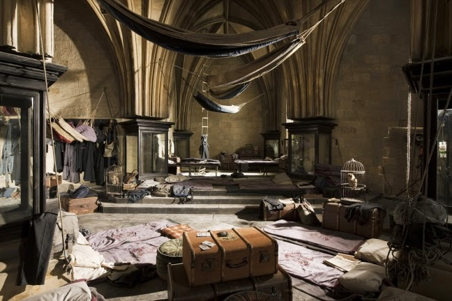

# **Harry Potter y Markdown**

## El contenido de Markdown
Harry, Ron, Hermione, Fred y George salieron por el vestíbulo; los gemelos iban hablando de cómo podían estructurar y mejorar el mapa del merodeador utiilizando **Markdown**.  
Hermione sugirió primero estructurar un documento como este a modo de resumen y distribuido por capítulos, para ayudar a los gemelos.

Los chicos estuvieron de acuerdo, asi que siguieron a Hermione a la biblioteca para ponerse manos a la obra.

## Las listas de Markdown

### Libros que tienen que buscar Ron y Harry

* Learn Markdown
* Markdown and Magic
* Gryffindor, Slytherin y Markdown
  * Markdown en Hogwarts
    * Página 394

### Lista de cosas que hacer de Hermione

1. Buscar documentación
2. Preguntar a Macgonagall
3. Prácticar 
4. Hacer esquema y pruebas
5. Presentar boceto a los chicos

## Resaltando lo relevante
A Hermione se le ha ocurrido que si utiliza el hechizo **_Accio_** puede convocar los libros necesarios ya que los chicos no los encuentran.
Aunque tambien podría pedir un permiso para entrar en la **sección prohibida.**  

*¿Qué profesor le concedería el permiso?* se preguntó para sus adentros.

## Código de utilidad
En uno de los libros Hermione ha encontrado un código que puede serle de utilidad, asi que decide incluirlo en su documento .ms, cuanto mejor documentado este, más fácil será todo luego:
```python
# -- Algoritmo Sombrero seleccionador
if q1_answer == "a":
  gryffindor = gryffindor + 1
  elif q1_answer == "b":
  ravenclaw += 1
elif q1_answer == "c":
  hufflepuff += 1
elif q1_answer == "d":
  slytherin += 1
```
Dicho código en ejemplo de aplicación `for house in houses:
  print(house)`

## Enlazando documentación

### Enlaces de Hosgmeade

Es importante revisar la información de [Honeydukes](https://harrypotter.fandom.com/es/wiki/Honeydukes), ya que uno de los túneles llega hasta el almacén. 

### Enlaces de Hogwarts

Hermione cree recordar haber leído algo relevante sobre Hogwarts y el Markdown en los libros que buscaron Harry y Ron en la biblioteca, pero... ¿en cuál de los [libros](#Libros-que-tienen-que-buscar-Ron-y-Harry) era?

## Imágenes de los pasadizos

Para poder hacer el esquema correcto, Hermione va a necesitar fotografías de los pasadizos. Así luego podrá ubicar correctamente la zona. El otro día Collin tomó una foto de la Sala de los Menesteres que puede ser de utilidad.  



Y quizá indagando en los libros de Historia de Hogwarts pueda encontrar una foto del sauce boxeador para marcar el pasadizo que lleva a la casa de los gritos. En movimiento como no, que es una foto mágica.


## Citas 

Cuando se trata de buscar en los libros, para Hermione es difícil sintetizar _Todo es importante_. Sin embargo tras las quejas de los chicos, y sus ideas, han reformulado algunas frases que no pueden faltar en el mapa del merodeador en honor de los caídos.
  
  Del mapa original:

>Juro solemnemente que esto es una travesura.  

De Sirius Black uno de sus creadores:

>¿Qué es la vida sin un poco de riesgo?  

De Hermione, una frase que podría ser la despedida del mapa:

> Espero que estéis satisfechos con lo que habéis hecho. Podríamos haber muerto, o aún peor, haber sido expulsados.

## Tablas

Hermione es una fanática del orden y los resumenes asi que en su documento esquema sobre como va a estructurarse el nuevo mapa del merodeador y la documentación, no podían faltar las tablas resumen. 
Primero de las zonas a tener en cuenta en el mapa en cuanto atajos, escondites y pasadizos.  


|                   | Atajos| Escondites| Pasadizos|
|---------          |------ |------|------|
|  Planta Baja      |   2   |   3  |  4   |
|  Plantas Superior |   4   |   6  |  5   |
|  Zona exterior    |   6   |   7  |  1  |  
  
    

Y por último una tabla con las zonas que no aparecían en el antiguo mapa porque aún no se conocían, o porque no había espacio, con enlaces a libros que tienen más información sobre dichas zonas.

|          |  Otras  | zonas | interés |
|----------|-----------|--------|-------|
| Ubicación| Subterráneo    |  Séptimo piso| Exterior      |
| Más información    |  [Cámara](https://harrypotter.fandom.com/es/wiki/C%C3%A1mara_de_los_Secretos) | [Sala](https://harrypotter.fandom.com/es/wiki/Sala_de_los_Menesteres#Ubicaci.C3.B3n_y_forma_de_convocaci.C3.B3n)  | [Bosque](https://harrypotter.fandom.com/es/wiki/Bosque_prohibido)   

Con todo esto, creo que Hermione y los chicos tienen suficiene para aventurarse en Markdown. Seguro que el nuevo mapa de merodeador queda fetén, aunque de algún lío estando estos chicos involucrados no estan exentos. Y a saben,los espacios son muy traicioneros. Continuaremos en nuevos capítulos, hasta entonces, ya saben:

# _**Travesura realizada**_